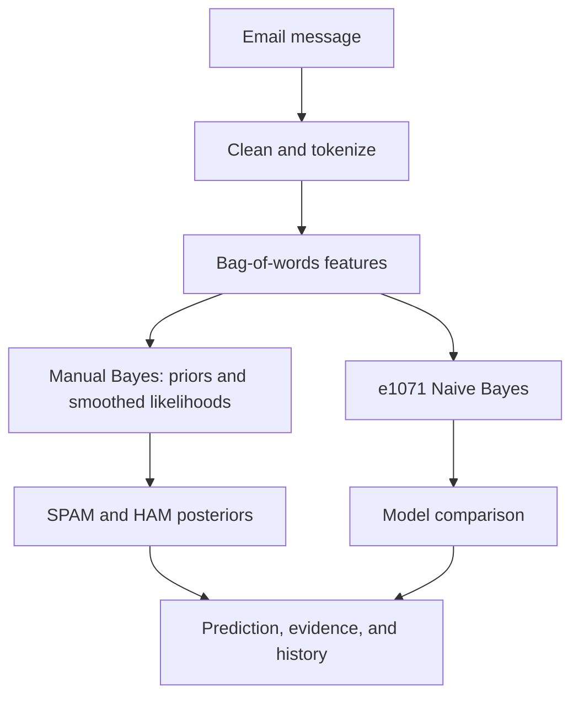

# Email Guard

### Bayesian email spam detection, made explainable

An interactive **R + Shiny** mini project that classifies email as **SPAM** or **HAM** and shows the probability calculations behind the decision.


> **Academic demonstration only.** The included emails are fictional and template-generated. This project is not a production spam filter and must not be used for real security decisions.

## At a glance

- Enter an email and compare its SPAM and HAM probabilities.
- Inspect learned word likelihoods and a step-by-step manual Bayes calculation.
- Compare a hand-built multinomial model with `e1071::naiveBayes()`.
- Explore the dataset, confusion matrix, test metrics, and in-session prediction history.
- Reproduce the training split and results with a fixed random seed.

## Run it

Use **R 4.6.1 or later** and the VS Code **R** extension. Open this repository as the workspace, start an R terminal with **R: Create R Terminal**, and install the packages once:

```r
install.packages(c(
	"shiny", "shinydashboard", "dplyr", "stringr", "tm",
	"e1071", "ggplot2", "plotly", "DT"
))
```

From the project root, train and save the models:

```r
source("train.R")
```

Launch the dashboard:

```r
shiny::runApp()
```

The app opens in your browser. It also trains the models at startup and refreshes `models/naive_bayes_model.rds`.

## Try a message

**SPAM sample**

> Congratulations! You have won a free cash prize. Click now to claim your reward!

**HAM sample**

> Hello team, our project meeting has been scheduled for tomorrow at 10 AM. Please bring your report.

The dashboard includes buttons that load these examples for quick testing.

## How the classifier works



For class $C$ and observed word $w$, Bayes' theorem is:

$$P(C \mid w)=\frac{P(w \mid C)P(C)}{P(w)}$$

For a message with words $w_1,\ldots,w_n$, Naive Bayes uses the conditional-independence assumption:

$$P(C \mid w_1,\ldots,w_n) \propto P(C)\prod_{i=1}^{n}P(w_i \mid C)$$

The manual model uses a multinomial word-count likelihood with Laplace smoothing:

$$P(w \mid C)=\frac{\operatorname{count}(w,C)+1}{\operatorname{totalTokens}(C)+|V|}$$

It adds log probabilities instead of multiplying many tiny values, then normalizes the SPAM and HAM scores into posteriors that sum to 100%. The `e1071` comparison uses binary word-presence features; the manual model uses word counts, so the feature representations are intentionally different.

### Text preparation

The shared `clean_text()` function lowercases text; removes HTML, URLs, email addresses, punctuation, and numbers; collapses whitespace; and removes English stopwords. `tm::DocumentTermMatrix()` creates the training feature matrix. Vocabulary selection and sparse-term filtering use training data only.

## Dataset and evaluation

`data/spam_dataset.csv` contains 500 fictional examples: **300 SPAM** and **200 HAM**. The seeded training pipeline uses an 80/20 stratified split, so the held-out test set contains 100 messages. Seed `123` makes the split reproducible.

| Model | Accuracy | Precision (SPAM) | Recall (SPAM) | F1 |
|---|---:|---:|---:|---:|
| Manual Bayes | 100.00% | 100.00% | 100.00% | 100.00% |
| e1071 Naive Bayes | 100.00% | 100.00% | 100.00% | 100.00% |

These values are calculated from actual predictions on the fixed test split. The manual model's confusion matrix is **TP 60, FN 0, FP 0, TN 40**. The perfect scores are expected for this small, template-generated dataset, whose vocabulary makes the classes unusually easy to distinguish. They do **not** estimate performance on natural email.

## Dashboard pages

| Page | What you can inspect |
|---|---|
| Home | Project overview, learned class prior, and vocabulary size |
| Spam Detector | Prediction, both posteriors, confidence, influential words, and model comparison |
| Bayes Calculation | Priors, detected words, conditional probabilities, log scores, and normalized result |
| Dataset | Class counts, distribution chart, and searchable messages |
| Model Performance | Calculated metrics, confusion matrix, and model comparison |
| Prediction History | Current-session predictions with a clear-history action |
| About | Method and limitations |

## Project layout

```text
.
├── app.R
├── train.R
├── spam_dataset.csv
├── data/
│   └── spam_dataset.csv
├── R/
│   ├── generate_dataset.R
│   ├── preprocessing.R
│   ├── manual_bayes.R
│   ├── train_model.R
│   ├── evaluation.R
│   └── prediction.R
├── models/
│   ├── naive_bayes_model.rds
│   ├── model_metrics.csv
│   └── manual_confusion_matrix.csv
├── tests/
│   ├── test_pipeline.R
│   └── test_app.R
├── www/
│   ├── style.css
│   └── custom.js
├── PROJECT_REPORT.md
└── PRESENTATION.md
```

## Test the project

Run in an R terminal from the repository root:

```r
source("tests/test_pipeline.R")
source("tests/test_app.R")
```

The checks cover data size and balance, train/test separation, both classifiers, expected sample labels, posterior normalization, evaluation outputs, Shiny startup, empty input, and history clearing.

## Project documents

- [Undergraduate project report](PROJECT_REPORT.md)
- [10-slide presentation outline](PRESENTATION.md)

## Limitations and next steps

This is a small, English-only synthetic dataset. The models treat words as conditionally independent and do not use word order, sender reputation, attachments, or email headers. A meaningful real-world evaluation would require a suitably licensed corpus, duplicate/leakage checks, cross-validation, and careful error analysis.

## License

No license has been specified for this repository. Contact the repository owner before reusing or redistributing the project.